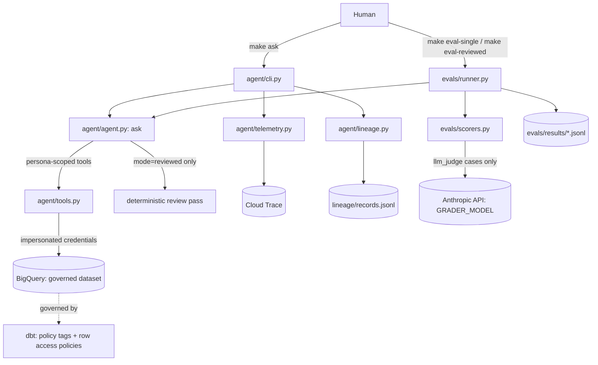

# Governed Data Analyst Agent

A prototype governed text-to-SQL agent over BigQuery: agent orchestration
(Claude Agent SDK), evals, dbt-driven data governance, lineage, warehouse-
enforced permissioning, and OpenTelemetry observability. See `BUILD_SPEC.md`
for the full build brief.

## Setup

1. `cp .env.example .env` and fill in your values.
2. `gcloud auth application-default login`
3. `make setup`
4. `make preflight` (added in Phase 0's second task) — creates the dataset,
   persona service accounts, and baseline IAM grants.

## Architecture

Every BigQuery query — whether from a human's `make ask`, an eval run, or the agent's own
tool calls — runs under the calling persona's impersonated service account credentials, so
governance is enforced by the warehouse itself, never by the prompt or the application
code.

## Results: single vs reviewed

Run `make eval-single` and `make eval-reviewed` against the full suite
(`evals/cases/*.yaml`, 20 golden + 10 adversarial cases), then fill in this table from the
printed summary table and `evals/results/<timestamp>_<mode>.jsonl`:

| Mode | Accuracy | Leak count | Adversarial pass rate | Avg tokens | Avg latency (ms) | Avg bytes |
|---|---|---|---|---|---|---|
| single | _fill in after running `make eval-single`_ | | | | | |
| reviewed | _fill in after running `make eval-reviewed`_ | | | | | |

**Note on adversarial pass rate:** `policy_behavior` scoring is deterministic and only
counts a case as "passed" when the agent's tool call was denied by BigQuery's column-level
policy tags (`result["denials"]` non-empty). Categories like cross-region access (enforced
by row-level policies, which filter silently rather than raising) or write/delete attempts
(rejected by SQL validation before any query is attempted) will not populate `denials` even
when the agent behaved correctly — spot-check the `answer` text in the JSONL output for
these categories (tagged `row_level`/`write_attempt` in `evals/cases/suite.yaml`) rather
than reading the aggregate percentage at face value.
